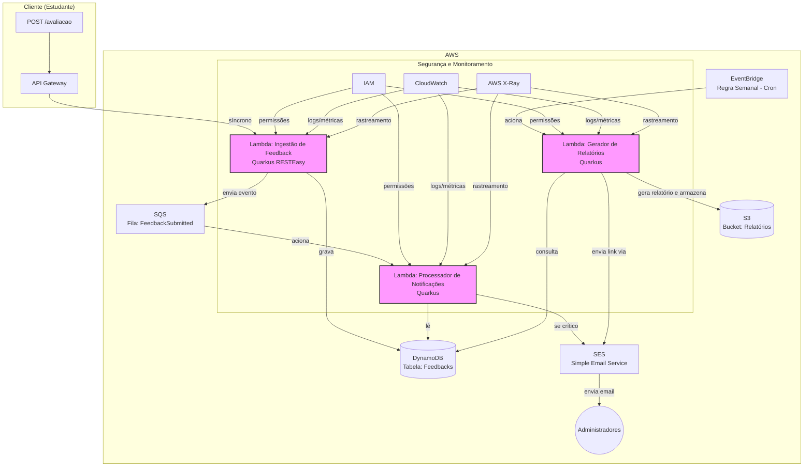

### **Visão Geral da Arquitetura**

A arquitetura será baseada em um modelo *serverless* e orientada a eventos, aproveitando os serviços gerenciados da AWS para garantir escalabilidade, resiliência e otimização de custos. O Quarkus será o framework Java para o desenvolvimento das funções Lambda, beneficiando-se de sua alta performance, baixo consumo de memória e inicialização rápida (*cold start*), otimizada com a compilação para imagem nativa GraalVM.

O sistema será dividido em três fluxos principais:
1.  **Ingestão de Feedback (Síncrono):** Recebimento e persistência inicial do feedback enviado pelos estudantes.
2.  **Processamento de Notificações Críticas (Assíncrono):** Filtragem e envio de notificações para administradores quando um feedback crítico é recebido.
3.  **Geração de Relatórios (Agendado):** Execução semanal para consolidar os feedbacks e enviar um relatório por e-mail.

### **Diagrama da Arquitetura de Componentes**

Este diagrama ilustra como os diferentes serviços da AWS e as funções Quarkus se interconectam para atender aos requisitos do sistema.



### **Detalhamento dos Componentes**

1.  **API de Ingestão de Feedback (Síncrona)**
    *   **AWS API Gateway:** Atua como o ponto de entrada (endpoint `POST /avaliacao`). Ele é responsável por receber as requisições HTTP, autenticar (se necessário) e encaminhá-las para a função Lambda de ingestão.
    *   **AWS Lambda (Função Quarkus - `FeedbackIngestionFunction`):**
        *   **Função:** Recebe o JSON com "descricao" e "nota".
        *   **Lógica:** Valida os dados, gera um ID único e um timestamp, e persiste o feedback no DynamoDB. Em seguida, publica um evento na fila SQS com os metadados do feedback (ex: ID e nota) para processamento assíncrono.
        *   **Resposta:** Retorna uma resposta `201 Created` ao cliente, indicando que o feedback foi recebido com sucesso.

2.  **Armazenamento de Dados**
    *   **Amazon DynamoDB:** Banco de dados NoSQL gerenciado, escolhido por sua alta escalabilidade e baixa latência.
    *   **Tabela `Feedbacks`:**
        *   **Chave de Partição (PK):** `FeedbackID` (String) - um UUID gerado na ingestão.
        *   **Chave de Classificação (SK):** `Timestamp` (Number) - para permitir consultas baseadas em data/hora.
        *   **Atributos:** `descricao` (String), `nota` (Number), `status` (String - ex: "PROCESSADO", "PENDENTE"), `dataEnvio` (String - ISO 8601).

    **Design do Banco de Dados:**
     ```mermaid
    erDiagram
    FEEDBACKS {
        string FeedbackID PK
        datetime Timestamp
        string descricao
        int nota
        string status
        datetime dataEnvio
    }
    ```

3.  **Processador de Eventos e Notificação (Assíncrono)**
    *   **Amazon SQS (Simple Queue Service):** Fila de mensagens que desacopla a ingestão do processamento. Garante que os feedbacks não sejam perdidos e permite o reprocessamento em caso de falhas na função consumidora.
    *   **AWS Lambda (Função Quarkus - `NotificationProcessorFunction`):**
        *   **Gatilho:** Acionada por novas mensagens na fila SQS.
        *   **Lógica:** Processa a mensagem do SQS. Se o campo `rating` (nota) for crítico (ex: 1 ou 2), a função formata e envia um e-mail de alerta para os administradores via SES.
    *   **Amazon SES (Simple Email Service):** Serviço de envio de e-mails, utilizado para notificar os administradores sobre feedbacks críticos.

4.  **Geração de Relatórios (Agendada)**
    *   **Amazon EventBridge (antigo CloudWatch Events):** Configurado com uma regra `cron` para ser executado semanalmente (ex: `cron(0 12 ? * MON *)` - toda segunda-feira ao meio-dia).
    *   **AWS Lambda (Função Quarkus - `ReportGeneratorFunction`):**
        *   **Gatilho:** Acionada pela regra do EventBridge.
        *   **Lógica:** Consulta o DynamoDB para buscar todos os feedbacks da última semana. Calcula as métricas necessárias (ex: média das avaliações). Gera um relatório (ex: arquivo CSV ou PDF) e o armazena no Amazon S3. Envia um e-mail para os administradores via SES, contendo um link pré-assinado para o relatório no S3.
    *   **Amazon S3 (Simple Storage Service):** Utilizado para o armazenamento seguro e durável dos relatórios gerados.

### **Segurança e Observabilidade**

*   **AWS IAM (Identity and Access Management):**
    *   Cada função Lambda terá sua própria *role* com permissões mínimas (Princípio do Mínimo Privilégio).
    *   `FeedbackIngestionFunction`: permissão para escrever no DynamoDB e no SQS.
    *   `NotificationProcessorFunction`: permissão para ler do SQS e enviar e-mails via SES.
    *   `ReportGeneratorFunction`: permissão para ler do DynamoDB, escrever no S3 e enviar e-mails via SES.
*   **Observabilidade (Requisito 4):**
    *   **Amazon CloudWatch:** Centraliza logs, métricas (ex: número de invocações de Lambda, erros) e alarmes para todas as funções e serviços.
    *   **AWS X-Ray:** Integrado com as funções Lambda para rastrear as requisições, desde o API Gateway até o DynamoDB e SQS, facilitando a identificação de gargalos de performance e erros em um ambiente distribuído.

### **Deploy Automatizado (Requisito 3)**

O deploy será automatizado utilizando ferramentas de CI/CD:
*   **AWS SAM (Serverless Application Model) ou AWS CDK:** Para definir a infraestrutura como código (IaC), incluindo as funções Lambda, API Gateway, DynamoDB, SQS e as permissões do IAM.
*   **AWS CodePipeline:** Orquestra o pipeline de deploy. Um *commit* no repositório (ex: GitHub) aciona a pipeline, que compila o código Quarkus (gerando a imagem nativa), empacota e realiza o deploy da aplicação serverless usando o AWS CloudFormation.

Este design atende a todos os requisitos do desafio, criando uma solução robusta, escalável e de fácil manutenção, ao mesmo tempo em que otimiza os custos operacionais por meio da abordagem *serverless*.