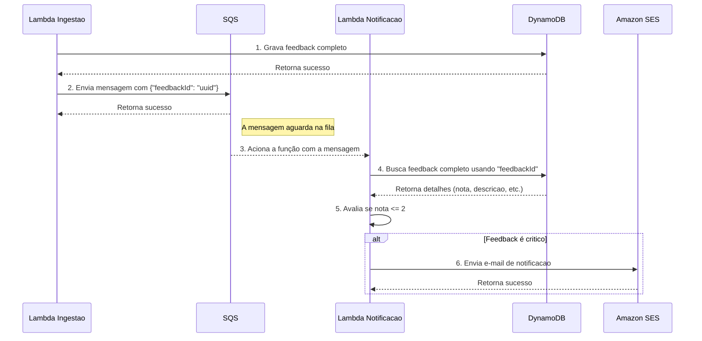

Com certeza. Vamos fazer um deep dive no Processador de Eventos e Notificação.

Este componente é o coração do processamento assíncrono do sistema. Sua principal responsabilidade é desacoplar a resposta imediata ao usuário (que já aconteceu na etapa de ingestão) do processamento de regras de negócio que podem demorar mais ou falhar, como o envio de um e-mail.

Visão Geral do Fluxo

A função FeedbackIngestionFunction recebe um feedback e, após salvá-lo no DynamoDB, publica uma mensagem simples na fila SQS. Essa mensagem contém apenas o identificador do feedback (FeedbackID).

A fila SQS retém a mensagem até que um consumidor esteja pronto.

A função NotificationProcessorFunction é acionada automaticamente pela AWS quando há novas mensagens na fila.

A função processa a mensagem, busca os detalhes completos do feedback no DynamoDB usando o FeedbackID.

Ela então aplica a lógica de negócio: "A nota é crítica (ex: 1 ou 2)?".

Se for crítica, ela monta e envia um e-mail para os administradores via SES.

Após o processamento bem-sucedido, a mensagem é removida da fila SQS para não ser processada novamente. Se ocorrer um erro, a mensagem permanece na fila para uma nova tentativa, ou é movida para uma Dead-Letter Queue (DLQ) após algumas falhas.

Diagrama de Sequência Detalhado

Este diagrama mostra a interação exata entre os componentes neste fluxo.

Como Ficaria a API (Função Lambda Quarkus) em Detalhes

A "API" aqui não é uma API REST, mas sim um handler de eventos.

Dependências (pom.xml):
Você precisará das extensões Quarkus para:

quarkus-amazon-lambda

quarkus-amazon-sqs

quarkus-amazon-dynamodb

quarkus-amazon-ses

quarkus-jsonb ou quarkus-jackson

Estrutura do Código (Exemplo Simplificado):

code
Java
download
content_copy
expand_less
import com.amazonaws.services.lambda.runtime.Context;
import com.amazonaws.services.lambda.runtime.RequestHandler;
import com.amazonaws.services.lambda.runtime.events.SQSEvent;
import javax.inject.Inject;
import javax.inject.Named;

@Named("notificationProcessor")
public class NotificationProcessorFunction implements RequestHandler<SQSEvent, Void> {

    @Inject
    FeedbackRepository feedbackRepository; // Classe que interage com o DynamoDB

    @Inject
    EmailService emailService; // Classe que encapsula o envio de e-mail com SES

    // Limite para considerar um feedback como crítico
    private static final int NOTA_CRITICA_LIMITE = 2;

    @Override
    public Void handleRequest(SQSEvent event, Context context) {
        for (SQSEvent.SQSMessage msg : event.getRecords()) {
            try {
                // 1. Parse da mensagem para obter o ID do feedback
                String feedbackId = parseFeedbackIdFromMessage(msg.getBody());
                context.getLogger().log("Processando feedback ID: " + feedbackId);

                // 2. Buscar o objeto de feedback completo no DynamoDB
                Feedback feedback = feedbackRepository.findById(feedbackId);

                if (feedback == null) {
                    context.getLogger().log("Feedback não encontrado: " + feedbackId);
                    continue; // Pula para a próxima mensagem
                }

                // 3. Aplicar a regra de negócio
                if (feedback.getNota() <= NOTA_CRITICA_LIMITE) {
                    context.getLogger().log("Feedback crítico detectado. Enviando notificação...");
                    emailService.enviarEmailDeAlerta(feedback);
                }

            } catch (Exception e) {
                // Se ocorrer um erro, a mensagem não será removida da fila e
                // será processada novamente após o 'Visibility Timeout'.
                // Lançar a exceção fará a invocação falhar.
                context.getLogger().log("Erro ao processar mensagem: " + e.getMessage());
                throw new RuntimeException("Falha no processamento", e);
            }
        }
        return null;
    }

    private String parseFeedbackIdFromMessage(String body) {
        // Lógica para extrair o "feedbackId" do JSON: { "feedbackId": "uuid-123" }
        // Usando Jsonb ou Jackson
        // ...
        return "uuid-123"; // Exemplo
    }
}
O Que Preciso Configurar na AWS?

Para este componente funcionar, você precisa configurar os seguintes recursos:

1. Amazon SQS (Fila de Mensagens)

Nome da Fila: FeedbackSubmittedQueue.

Tipo: Fila Padrão (Standard Queue) é suficiente, pois a ordem exata não é crítica e oferece maior throughput.

Configurações Chave:

Visibility Timeout (Tempo de Visibilidade): Defina um tempo ligeiramente maior que o timeout da sua função Lambda (ex: se a Lambda tem timeout de 30s, defina o SQS para 45s). Isso evita que outra instância da função pegue a mesma mensagem enquanto a primeira ainda está processando.

Dead-Letter Queue (DLQ): ESSENCIAL para resiliência. Crie uma segunda fila SQS (ex: FeedbackFailedQueue) e configure-a como a DLQ da fila principal. Se uma mensagem falhar no processamento um número configurado de vezes (ex: 3 vezes), o SQS a moverá automaticamente para a DLQ. Isso impede que uma mensagem "envenenada" bloqueie o processamento e permite que você analise a falha manualmente.

2. AWS Lambda (Função NotificationProcessorFunction)

Runtime: Custom Runtime on Amazon Linux 2 (para usar a imagem nativa GraalVM do Quarkus, que garante a melhor performance de cold start).

Handler: Não é aplicável da mesma forma que em runtimes gerenciados. A configuração é feita no template SAM/CDK ou no bootstrap do pacote de deploy.

Gatilho (Trigger):

Serviço: SQS.

Fila SQS: Selecione a FeedbackSubmittedQueue criada anteriormente.

Batch Size (Tamanho do Lote): 1. Comece com 1 para simplificar a lógica de tratamento de erros. Processar uma mensagem por vez significa que se uma falhar, a invocação inteira falha e apenas aquela mensagem será reprocessada.

Variáveis de Ambiente:

DYNAMODB_TABLE_NAME: O nome da sua tabela DynamoDB (ex: Feedbacks).

ADMIN_EMAIL_ADDRESS: O e-mail do administrador para onde a notificação será enviada.

SOURCE_EMAIL_ADDRESS: O e-mail verificado no SES que será usado como remetente.

Memória e Timeout:

Memória: Comece com 256 MB. Imagens nativas Quarkus são muito eficientes.

Timeout: Comece com 30 segundos. É mais do que suficiente para buscar um item no DynamoDB e chamar a API do SES.

3. AWS IAM (Role de Execução da Lambda)
   A role associada à sua função Lambda precisa ter permissões mínimas para acessar os outros serviços:

Para o SQS:

sqs:ReceiveMessage

sqs:DeleteMessage

sqs:GetQueueAttributes

Para o DynamoDB:

dynamodb:GetItem (para ler o item específico do feedback)

Para o SES:

ses:SendEmail

Para o CloudWatch (para logging):

logs:CreateLogGroup

logs:CreateLogStream

logs:PutLogEvents

4. Amazon SES (Serviço de E-mail)

Verificação de Identidade: Antes de poder enviar e-mails, você deve verificar um endereço de e-mail (para o remetente, SOURCE_EMAIL_ADDRESS) ou um domínio inteiro no console do SES. Em um ambiente de sandbox da AWS, você também precisa verificar o e-mail do destinatário (ADMIN_EMAIL_ADDRESS).

Ao configurar esses quatro serviços e conectá-los corretamente, você terá um processador de eventos robusto, resiliente e escalável.